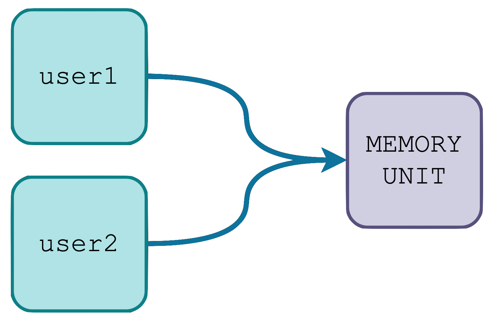

# UTILS
---
### CLONER
> We all know how ☕️Java works when copying an object, for those hwo don't know yet here's a little explanation:<br>
> Let's say you have an object User user1, and you want to make a copy of it:
```
User user1 = new User ("Edu", "Martorell);
User user2 = user1;

system.out.println(user1.getName()) -> Edu
system.out.println(user2.getName()) -> Edu
```

> The result of this is that you now have two users in different variables that point at the same memory unit.<br>
> The problem of this is that when you change one, you change both.<br>
> So if you would want to change user2's name to **Victor** you would do this:
```
user2.setName("Victor")
system.out.println(user2.getName()) -> Victor
system.out.println(user1.getName()) -> Victor
```
